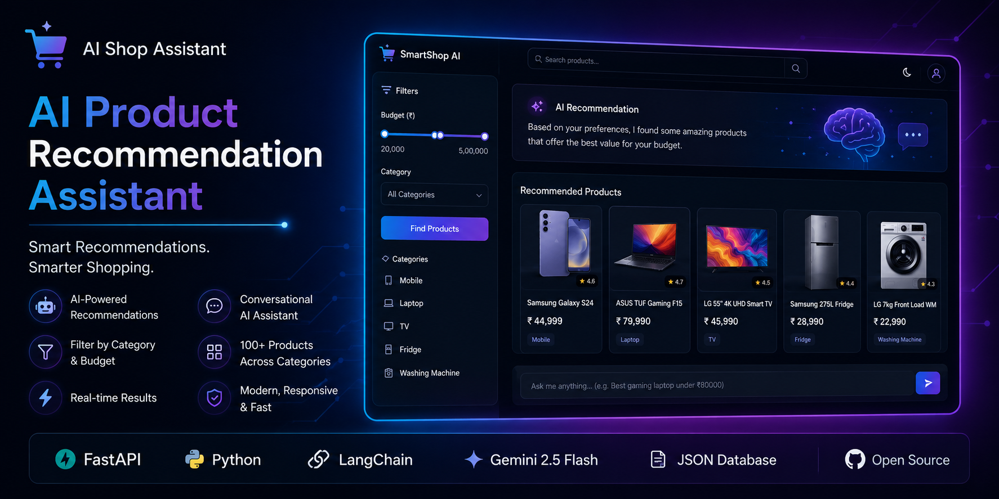
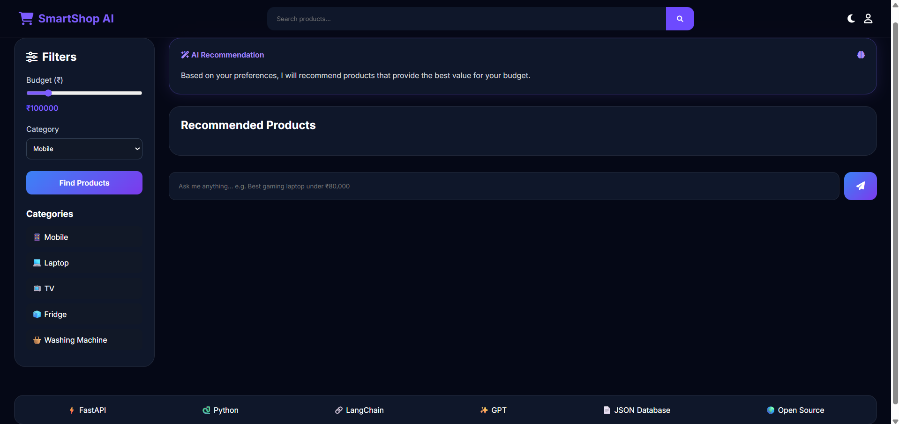
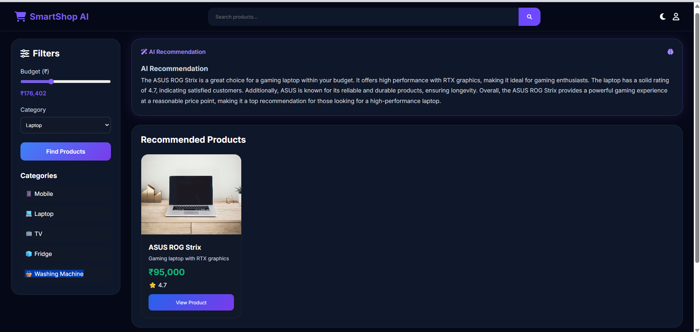

---
# 🛍️ AI Product Recommendation Assistant

An AI-powered product recommendation system built using FastAPI, LangChain, and Gemini 2.5 Flash. The application helps users discover products based on their requirements, budget, and category preferences through a modern interactive interface.

---

## 🚀 Features

* AI-powered product recommendations using Google Gemini 2.5 Flash
* Product search by category and budget
* Interactive chatbot interface
* Dynamic product card display
* Modern responsive UI
* FastAPI backend
* LangChain integration
* JSON-based product database
* Product image support
* Category filtering
* Real-time recommendations

---

## User Interface
### Home Page

### AI Response


---
## 🏗️ Project Architecture

```text
project/
│
├── data/
│   └── products.json
│
├── static/
│   ├── css/
│   │   └── style.css
│   │
│   ├── js/
│   │   └── script.js
│   │
│   └── images/
│
├── templates/
│   └── index.html
│
├── main.py
├── .env
├── requirements.txt
└── README.md
```

---

## ⚙️ Tech Stack

### Frontend

* HTML5
* CSS3
* JavaScript

### Backend

* FastAPI
* Python

### AI & LLM

* LangChain
* Openai GPT | Gemini-2.5-flash

### Data Storage

* JSON Product Database

---

## 🔄 Application Workflow

1. User enters a product-related query.
2. Frontend sends the query to the FastAPI backend.
3. LangChain processes the request.
4. Gemini-2.5-flash generates intelligent recommendations.
5. Backend retrieves matching products from the product database.
6. Recommended products are returned to the frontend.
7. Product cards and AI explanations are displayed to the user.

---

## 📦 Installation

### Clone Repository

```bash
git clone https://github.com/yourusername/ai-product-recommendation-assistant.git

cd ai-product-recommendation-assistant
```

### Create Virtual Environment

```bash
python -m venv venv
```

### Activate Virtual Environment

Windows:

```bash
venv\Scripts\activate
```

Linux/Mac:

```bash
source venv/bin/activate
```

### Install Dependencies

```bash
pip install -r requirements.txt
```

---

## 🔑 Environment Variables

Create a `.env` file in the root directory.

```env
OPENAI_API_KEY = your_openai_api
```

---

## ▶️ Run Application

```bash
uvicorn main:app --reload
```

Open your browser:

```text
http://localhost:8000
```

---

## 📊 Product Database Format

Example:

```json
{
  "id": 1,
  "name": "Samsung Galaxy S24",
  "category": "Mobile",
  "price": 74999,
  "rating": 4.8,
  "image": "image_url",
  "description": "Premium Android smartphone"
}
```

---

## 🎯 Future Improvements

* Vector Database Integration (FAISS/Pinecone)
* User Authentication
* Wishlist Functionality
* Product Comparison Feature
* Review Summarization
* Voice Search
* Personalized Recommendations
* Multi-Agent Architecture
* Shopping Cart Integration
* Price Tracking System

---

## 💡 Use Cases

* E-commerce Recommendation Systems
* Personalized Shopping Assistants
* AI-powered Product Discovery
* Retail Analytics Applications
* Customer Support Automation

---

## 👨‍💻 Author

Sahim Kazi

Built to explore LangChain, FastAPI, Google Gemini, and AI-powered recommendation systems.
